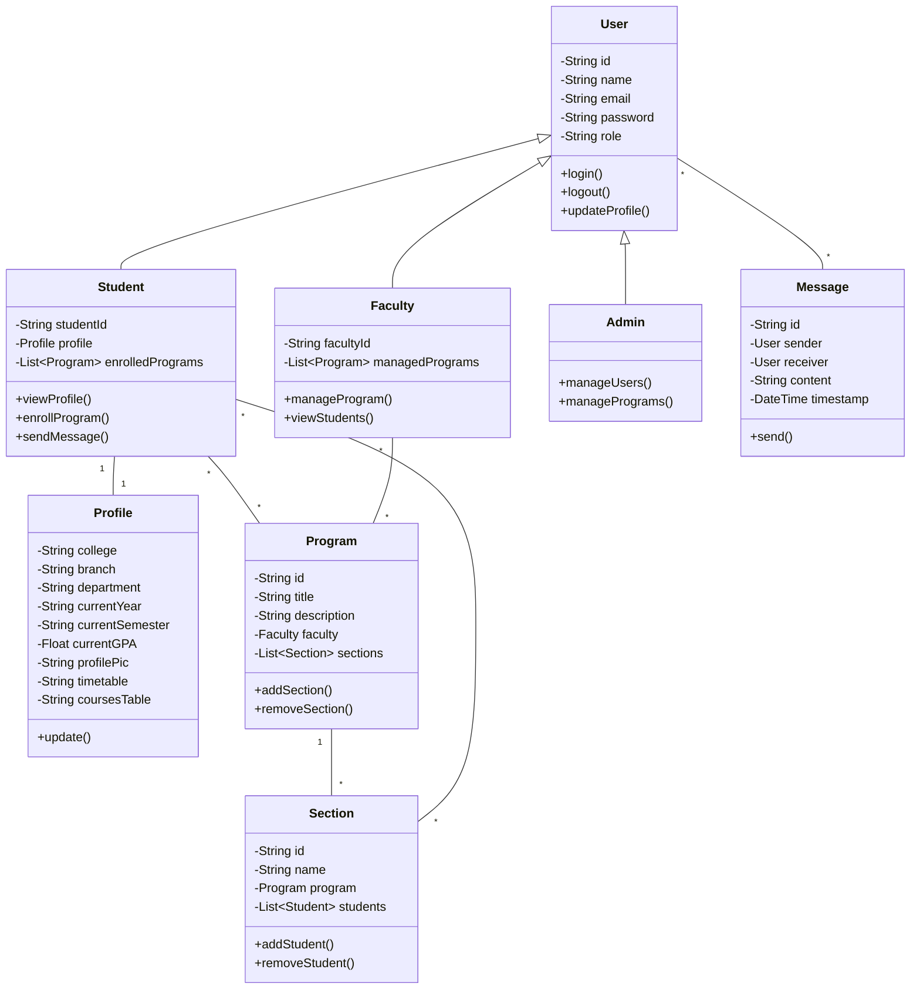

# Class Diagram

```mermaid
classDiagram
    class User {
        -String id
        -String name
        -String email
        -String password
        -String role
        +login()
        +logout()
        +updateProfile()
    }
    class Student {
        -String studentId
        -Profile profile
        -List~Program~ enrolledPrograms
        +viewProfile()
        +enrollProgram()
        +sendMessage()
    }
    class Faculty {
        -String facultyId
        -List~Program~ managedPrograms
        +manageProgram()
        +viewStudents()
    }
    class Admin {
        +manageUsers()
        +managePrograms()
    }
    class Profile {
        -String college
        -String branch
        -String department
        -String currentYear
        -String currentSemester
        -Float currentGPA
        -String profilePic
        -String timetable
        -String coursesTable
        +update()
    }
    class Program {
        -String id
        -String title
        -String description
        -Faculty faculty
        -List~Section~ sections
        +addSection()
        +removeSection()
    }
    class Section {
        -String id
        -String name
        -Program program
        -List~Student~ students
        +addStudent()
        +removeStudent()
    }
    class Message {
        -String id
        -User sender
        -User receiver
        -String content
        -DateTime timestamp
        +send()
    }
    User <|-- Student
    User <|-- Faculty
    User <|-- Admin
    Student "1" -- "1" Profile
    Student "*" -- "*" Program
    Faculty "*" -- "*" Program
    Program "1" -- "*" Section
    Section "*" -- "*" Student
    User "*" -- "*" Message
``` 