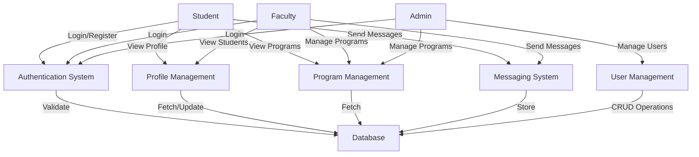

# Data Flow Diagram (DFD)

```mermaid
graph TD
    A[Student] -->|Login/Register| B[Authentication System]
    B -->|Validate| C[Database]
    A -->|View Profile| D[Profile Management]
    D -->|Fetch/Update| C
    A -->|View Programs| E[Program Management]
    E -->|Fetch| C
    A -->|Send Messages| F[Messaging System]
    F -->|Store| C
    G[Faculty] -->|Login| B
    G -->|Manage Programs| E
    G -->|View Students| D
    G -->|Send Messages| F
    H[Admin] -->|Login| B
    H -->|Manage Users| I[User Management]
    I -->|CRUD Operations| C
    H -->|Manage Programs| E
``` 