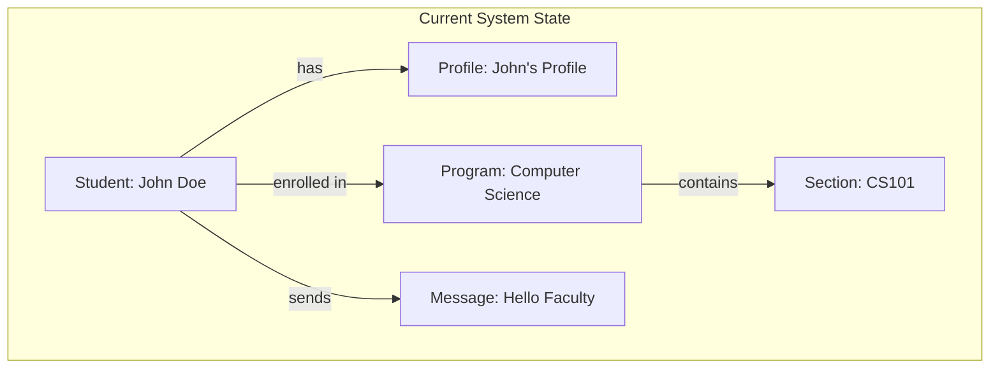

# Object Diagram (Example State)

```mermaid
graph TD
    subgraph Current System State
        A[Student: John Doe]
        B[Profile: John's Profile]
        C[Program: Computer Science]
        D[Section: CS101]
        E[Message: Hello Faculty]
        
        A -->|has| B
        A -->|enrolled in| C
        C -->|contains| D
        A -->|sends| E
    end
``` 