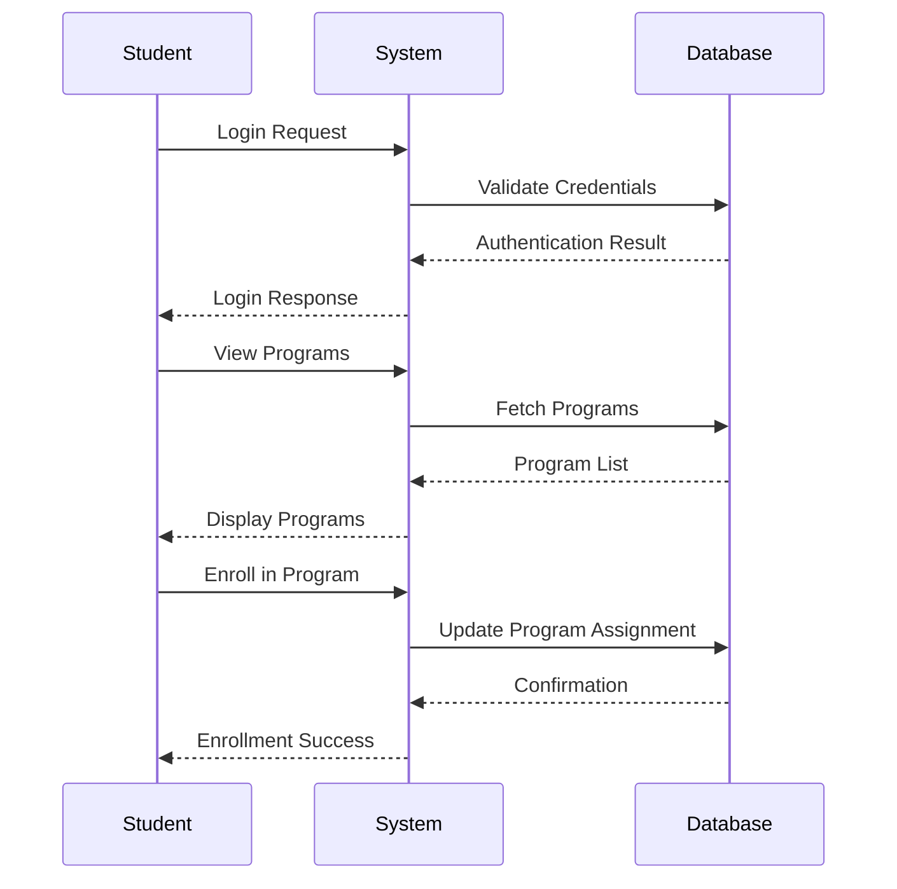

# Sequence Diagram (Program Enrollment)

```mermaid
sequenceDiagram
    participant S as Student
    participant SYS as System
    participant DB as Database
    
    S->>SYS: Login Request
    SYS->>DB: Validate Credentials
    DB-->>SYS: Authentication Result
    SYS-->>S: Login Response
    
    S->>SYS: View Programs
    SYS->>DB: Fetch Programs
    DB-->>SYS: Program List
    SYS-->>S: Display Programs
    
    S->>SYS: Enroll in Program
    SYS->>DB: Update Program Assignment
    DB-->>SYS: Confirmation
    SYS-->>S: Enrollment Success
``` 