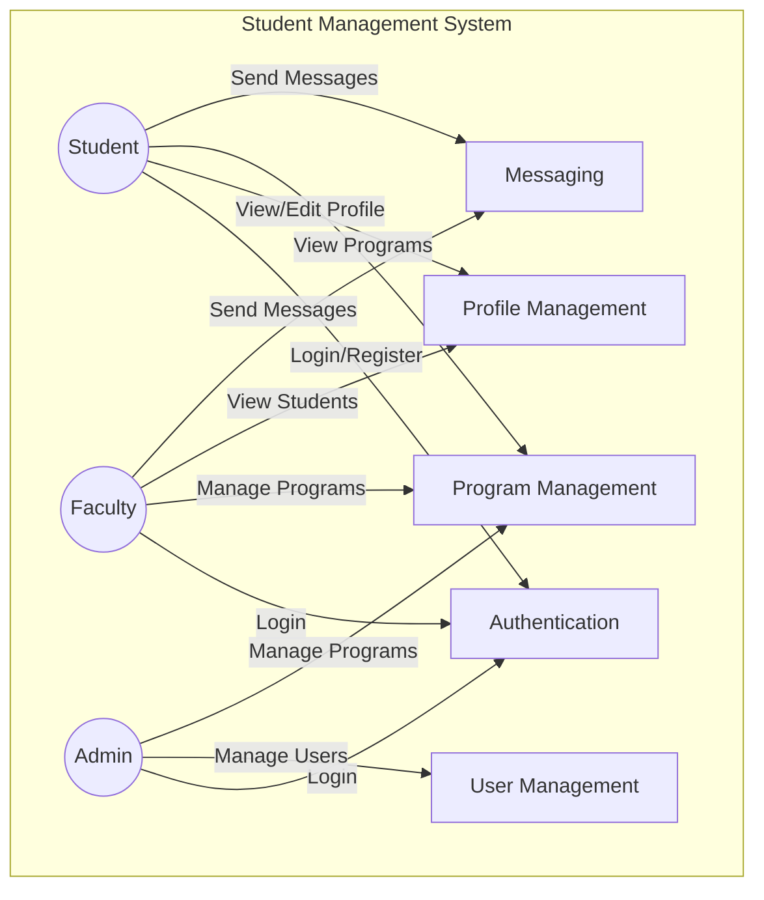

# Use Case Diagram

```mermaid
graph TD
    subgraph Student Management System
        A((Student))
        B((Faculty))
        C((Admin))
        
        A -->|Login/Register| D[Authentication]
        A -->|View/Edit Profile| E[Profile Management]
        A -->|View Programs| F[Program Management]
        A -->|Send Messages| G[Messaging]
        
        B -->|Login| D
        B -->|Manage Programs| F
        B -->|View Students| E
        B -->|Send Messages| G
        
        C -->|Login| D
        C -->|Manage Users| H[User Management]
        C -->|Manage Programs| F
    end
``` 