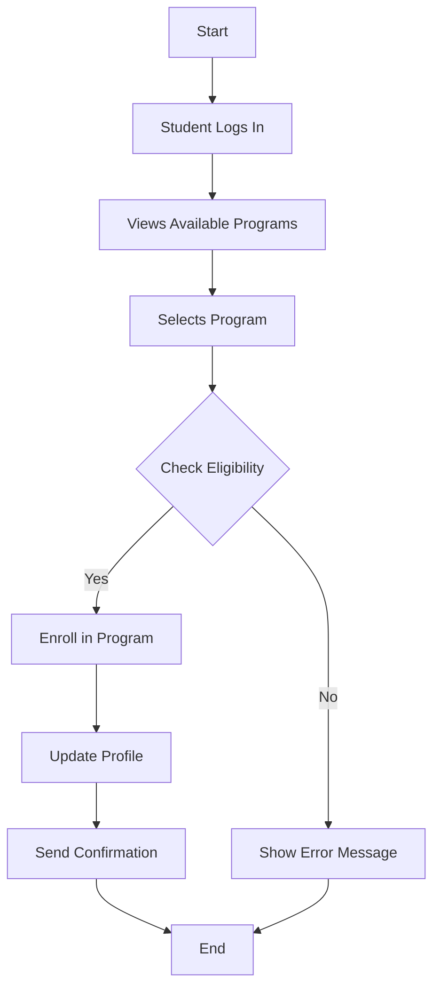

# Use Case Scenario (Program Enrollment)

```mermaid
graph TD
    A[Start] --> B[Student Logs In]
    B --> C[Views Available Programs]
    C --> D[Selects Program]
    D --> E{Check Eligibility}
    E -->|Yes| F[Enroll in Program]
    E -->|No| G[Show Error Message]
    F --> H[Update Profile]
    H --> I[Send Confirmation]
    I --> J[End]
    G --> J
``` 